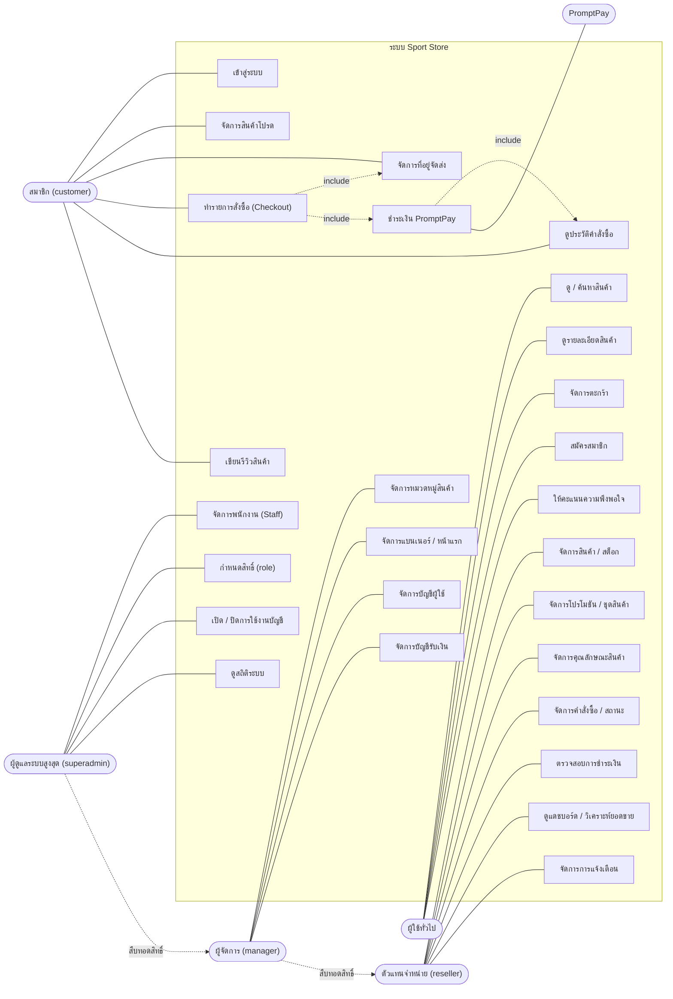
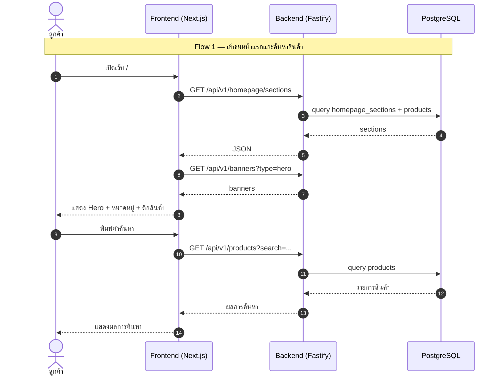
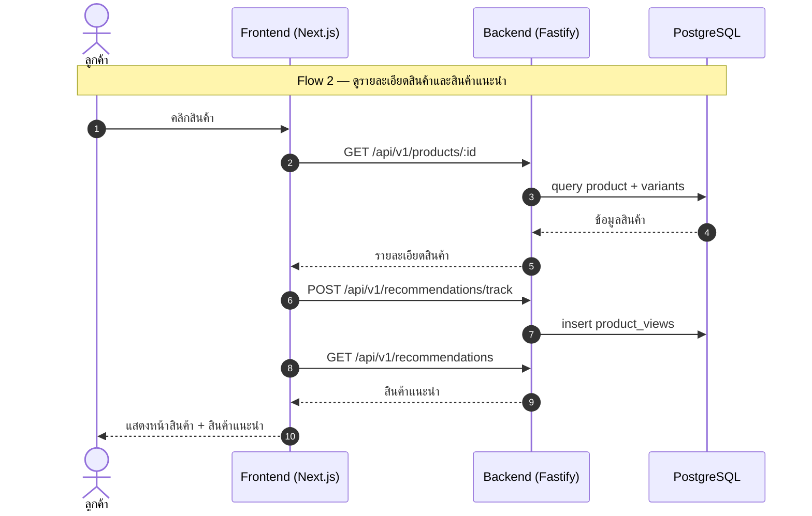
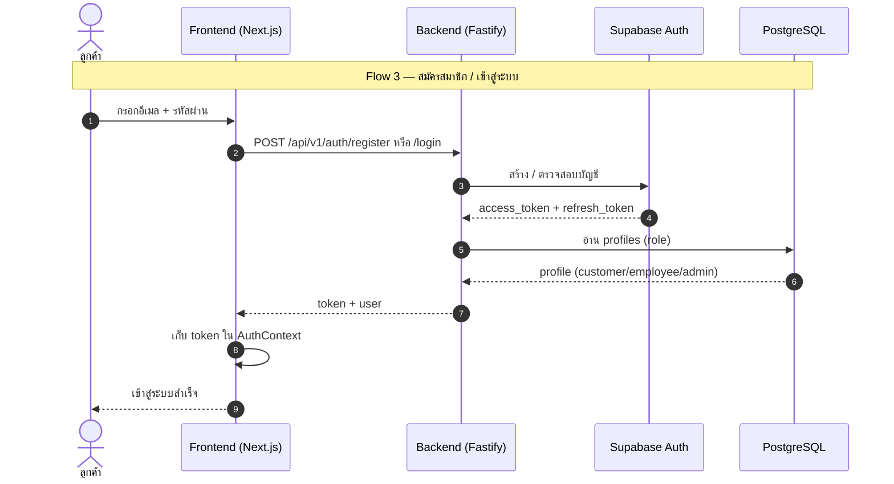
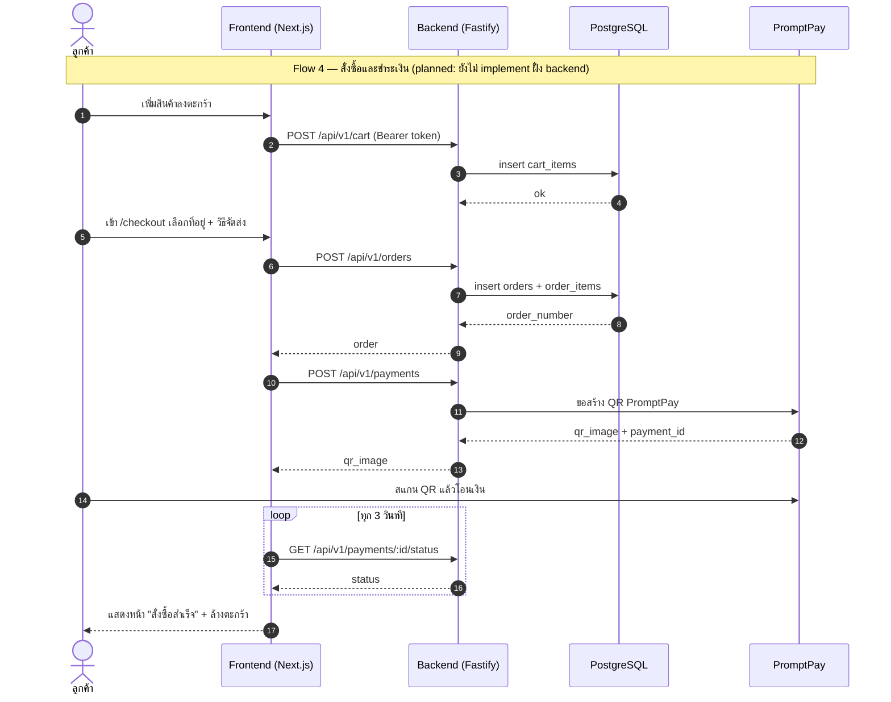
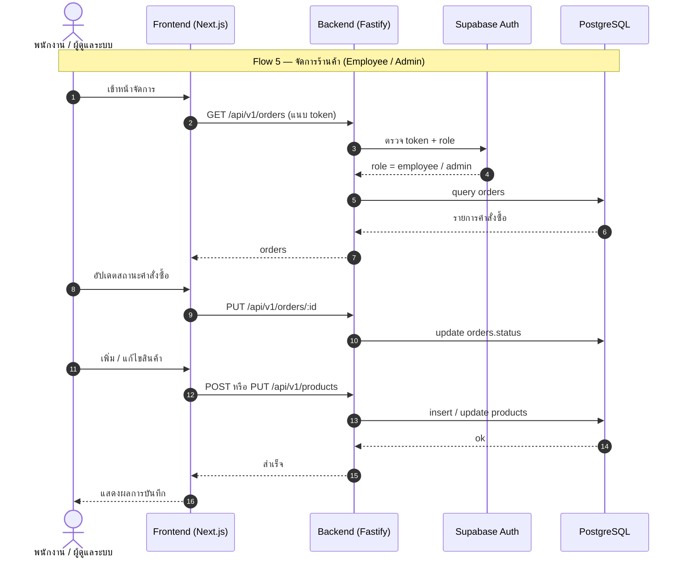
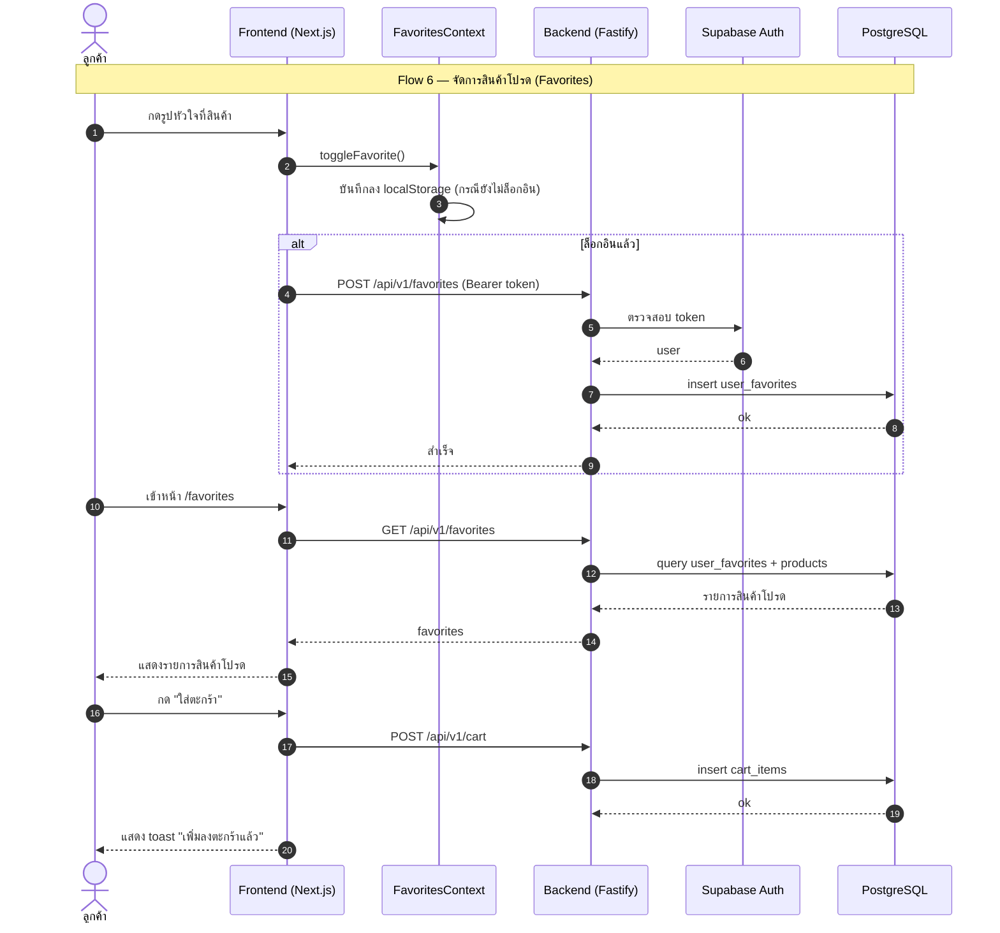
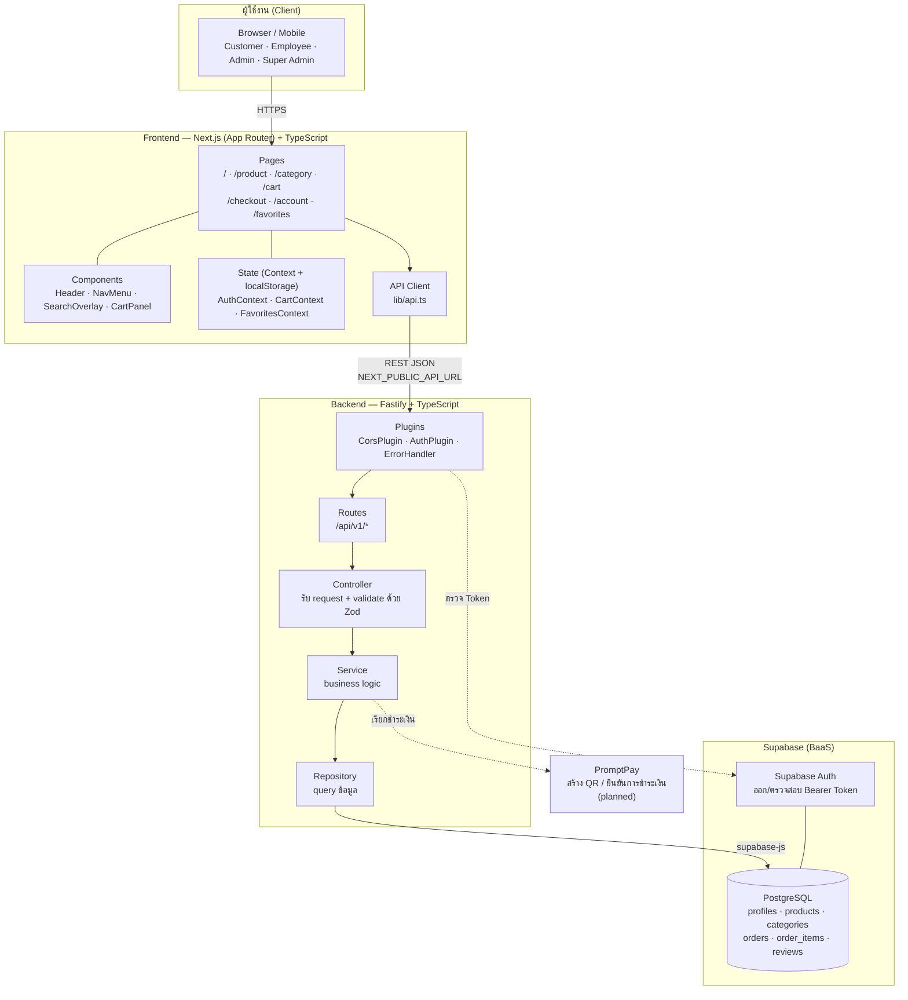
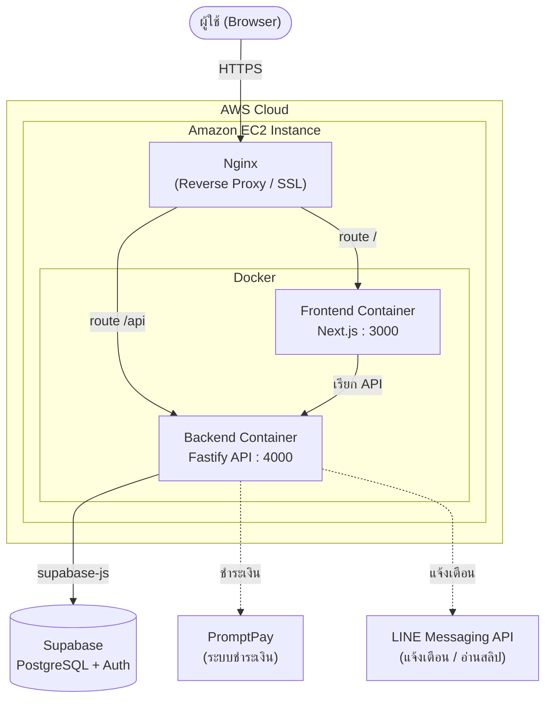

# Project 204 - Sport Store

Sport Store เป็นเว็บอีคอมเมิร์ซสำหรับขายสินค้าและอุปกรณ์กีฬา พัฒนาเป็นระบบแยก frontend และ backend โดยฝั่งหน้าเว็บใช้ Next.js สำหรับแสดงสินค้า หมวดหมู่ โปรโมชัน รายละเอียดสินค้า และตะกร้าสินค้า ส่วนฝั่ง API ใช้ Fastify เชื่อมต่อ Supabase เพื่อจัดการข้อมูลสินค้า หมวดหมู่ ผู้ใช้ ตะกร้า แบนเนอร์ โปรโมชัน และข้อมูลหน้าแรก

## รายละเอียดโปรเจกต์

โปรเจกต์นี้จำลองระบบร้านค้าออนไลน์สายกีฬา มีหน้าเว็บสำหรับให้ผู้ใช้เลือกดูสินค้า ค้นหาสินค้า ดูรายละเอียดสินค้า เลือกสินค้าเข้าตะกร้า และดูหมวดหมู่สินค้าต่าง ๆ พร้อม backend API สำหรับส่งข้อมูลไปยังหน้าเว็บ ระบบถูกแบ่งออกเป็น 2 ส่วนหลัก คือ

- `sport-store` ส่วน frontend ที่พัฒนาด้วย Next.js
- `sport-store-api` ส่วน backend API ที่พัฒนาด้วย Fastify และเชื่อมต่อ Supabase

## ฟีเจอร์หลัก

> **สถานะ:** ✅ ใช้งานได้จริง (frontend ต่อ backend แล้ว) · 🟡 มีหน้าจอแต่ยังไม่ต่อ backend (hardcode / localStorage) · ❌ frontend เรียกแล้วแต่ backend ยังไม่มี API

### 1. หน้าแรก (Homepage)

| # | ฟีเจอร์ | สถานะ | อ้างอิง |
| --- | --- | --- | --- |
| 1.1 | Hero banner สไลด์ | ✅ | `GET /api/v1/banners?type=hero` |
| 1.2 | หมวดหมู่ลัด (shortcuts) | ✅ | `GET /api/v1/homepage/shortcuts` |
| 1.3 | Section สินค้า (ดีล / แนะนำ / ตามหมวด) | ✅ | `GET /api/v1/homepage/sections` |
| 1.4 | ค่าคอนฟิกหน้าเว็บ (จำนวนสินค้า ฯลฯ) | ✅ | `GET /api/v1/homepage/config/all` |
| 1.5 | แถบประกาศ (Announcement bar) | 🟡 | ข้อความคงที่ในโค้ด |

### 2. หมวดหมู่และการค้นหา

| # | ฟีเจอร์ | สถานะ | อ้างอิง |
| --- | --- | --- | --- |
| 2.1 | หมวดหมู่หลายระดับ (แม่/ลูก) | ✅ | `GET /api/v1/categories/tree` |
| 2.2 | หน้าหมวดหมู่ + breadcrumb + หมวดย่อย | ✅ | `GET /api/v1/categories/route/:path` |
| 2.3 | ตัวกรอง แบรนด์ / สี / ช่วงราคา | ✅ | คำนวณจากสินค้าที่ได้จาก API |
| 2.4 | ค้นหาสินค้า (Search overlay) | ✅ | `GET /api/v1/products?search=` |
| 2.5 | เมนูนำทาง + เมนูมือถือ | ✅ | ใช้ category tree |

### 3. รายละเอียดสินค้า

| # | ฟีเจอร์ | สถานะ | หมายเหตุ |
| --- | --- | --- | --- |
| 3.1 | แกลเลอรีรูป / เลือกไซส์ / สี / จำนวน | ✅ | ต่อ API แล้ว |
| 3.2 | สินค้าแนะนำ (Related) | ✅ | `/api/v1/recommendations` |
| 3.3 | ชุดสินค้า (Bundle) | ✅ | `/api/v1/bundles` |
| 3.4 | รีวิวสินค้า + คะแนน | 🟡 | hardcode — ตาราง `reviews` มีใน DB แต่ยังไม่มี API |

### 4. ตะกร้าสินค้า

| # | ฟีเจอร์ | สถานะ | หมายเหตุ |
| --- | --- | --- | --- |
| 4.1 | เพิ่ม / แก้ไขจำนวน / ลบสินค้า | 🟡 | `CartContext` + localStorage |
| 4.2 | แผงตะกร้าด้านข้าง (CartPanel) | 🟡 | |
| 4.3 | คำนวณยอดรวม / ส่วนลด / ค่าส่ง | 🟡 | คำนวณฝั่ง client |
| 4.4 | เชื่อมตะกร้ากับบัญชีผู้ใช้ | ✅ | ตะกร้าผูกบัญชีแล้ว (persistent cart) |

### 5. ระบบสมาชิกและบัญชีผู้ใช้

| # | ฟีเจอร์ | สถานะ | อ้างอิง |
| --- | --- | --- | --- |
| 5.1 | สมัครสมาชิก | ✅ | `POST /api/v1/auth/register` |
| 5.2 | เข้าสู่ระบบ / ออกจากระบบ | ✅ | `/auth/login`, `/auth/logout` |
| 5.3 | ดูโปรไฟล์ + ต่ออายุ token | ✅ | `/auth/profile`, `/auth/refresh` |
| 5.4 | บทบาทผู้ใช้ (role) | ✅ | `customer` / `reseller` / `manager` / `superadmin` |
| 5.5 | role 4 ระดับ + superadmin | ✅ | `008_roles.sql` + `013_superadmin_role.sql` |
| 5.6 | หน้าบัญชีของฉัน (hub) | ✅ | `/account` |

### 6. สั่งซื้อและชำระเงิน

| # | ฟีเจอร์ | สถานะ | หมายเหตุ |
| --- | --- | --- | --- |
| 6.1 | หน้า checkout หลายขั้นตอน | 🟡 | UI ครบ (ที่อยู่ → จัดส่ง → ชำระเงิน) |
| 6.2 | สมุดที่อยู่ + เติมจังหวัด/อำเภอจากรหัสไปรษณีย์ | ✅ | `/api/v1/addresses` + ตาราง `user_addresses` |
| 6.3 | สร้างคำสั่งซื้อ | ✅ | `/api/v1/orders` |
| 6.4 | ชำระเงิน PromptPay QR + ตรวจสถานะ | ✅ | `/api/v1/payments` + ตาราง `payments`, `payment_accounts` |
| 6.5 | ประวัติคำสั่งซื้อ + รายละเอียด | ✅ | `/api/v1/orders/history` |

### 7. สินค้าโปรด (Favorites)

| # | ฟีเจอร์ | สถานะ | หมายเหตุ |
| --- | --- | --- | --- |
| 7.1 | กดหัวใจเพิ่ม/เอาออก | 🟡 | `FavoritesContext` + localStorage |
| 7.4 | Toast แจ้งเตือนตอนใส่ตะกร้า | ✅ | หน้า `/favorites` |
| 7.2 | หน้ารวมสินค้าโปรด `/favorites` | 🟡 | |
| 7.3 | ผูกสินค้าโปรดกับบัญชีผู้ใช้ | 🟡 | backend พร้อม (`/api/v1/favorites` + `user_favorites`) — frontend context ยังใช้ localStorage |

### 8. แบบประเมินความพึงพอใจ (Feedback)

| # | ฟีเจอร์ | สถานะ | หมายเหตุ |
| --- | --- | --- | --- |
| 8.1 | แผงประเมิน (คะแนน / วัตถุประสงค์) | 🟡 | UI อย่างเดียว |
| 8.2 | บันทึกผลประเมิน | ❌ | ยังไม่ส่งไป backend และไม่เก็บลง DB |

### 9. ฝั่งผู้ดูแลระบบ (Reseller / Manager / Super Admin)

| # | ฟีเจอร์ | สถานะ | หมายเหตุ |
| --- | --- | --- | --- |
| 9.1 | API จัดการสินค้า / หมวดหมู่ | ✅ | `/api/v1/products`, `/api/v1/categories` |
| 9.2 | API จัดการแบนเนอร์ / โปรโมชัน / bundle | ✅ | `/banners`, `/promotions`, `/bundles` |
| 9.3 | API จัดการหน้าแรก / attribute / variant | ✅ | `/homepage`, `/attributes` |
| 9.4 | **หน้าจอ Backoffice** | ✅ | `/backoffice` 13 หน้า (สินค้า/คำสั่งซื้อ/ผู้ใช้/แบนเนอร์/analytics ฯลฯ) |
| 9.5 | จัดการคำสั่งซื้อ / อัปเดตสถานะ | ✅ | `/api/v1/orders` (reseller ขึ้นไป) |

### 10. Backend API และฐานข้อมูล

| # | รายการ | สถานะ | รายละเอียด |
| --- | --- | --- | --- |
| 10.1 | Module ที่มีจริง (18) | ✅ | auth, product, category, cart, banner, homepage, promotion, bundle, attribute, recommendation, address, order, payment, favorite, notification, dashboard, analytics, superadmin |
| 10.2 | Health check | ✅ | `GET /api/health` ตรวจสถานะ database |
| 10.3 | ตรวจสอบสิทธิ์ด้วย Bearer Token | ✅ | ผ่าน Supabase Auth |
| 10.4 | ตรวจสอบ input | ✅ | Zod ทุก request |
| 10.5 | CORS | ✅ | `@fastify/cors` |
| 10.6 | Helmet / Rate Limit | ❌ | ติดตั้ง lib แล้วแต่ยังไม่ได้ register |
| 10.7 | ฐานข้อมูล 24 ตาราง | ✅ | `sql/001_init.sql` + `002_seed.sql` |
| 10.8 | ตาราง `user_addresses` / `payments` / `user_favorites` / `notifications` | ✅ | migration 003–013 |

## 🚧 งานที่ยังไม่เสร็จ — ขอความเห็นในทีม

> อัปเดตหลัง commit `d14d75d` (backoffice, roles, payment/favorites API, persistent cart)
> งานเดิมข้อ 1–4, 6, 7 **ทำเสร็จแล้ว** ขอบคุณครับ 🙏 เหลือรายการด้านล่าง

| # | งานที่เหลือ | สถานะปัจจุบัน | ผู้รับผิดชอบ |
| --- | --- | --- | --- |
| 1 | ต่อ `FavoritesContext` เข้ากับ API | backend มี `/api/v1/favorites` + ตาราง `user_favorites` แล้ว แต่ context ฝั่ง frontend ยังใช้ localStorage (มี `scripts/migrate-favorites.ts` เตรียมไว้) | |
| 2 | ระบบรีวิวสินค้า | ตาราง `reviews` มีใน DB แต่ยังไม่มี module API และหน้าสินค้ายังไม่แสดงรีวิวจริง | |
| 3 | ระบบ Feedback | เป็น UI อย่างเดียว ยังไม่ส่งข้อมูลไป backend และไม่บันทึกลง DB | |
| 4 | เปิดใช้ Helmet + Rate Limit | ติดตั้ง lib ไว้ใน `package.json` แล้ว แต่ยังไม่ได้ `register` ใน `Application.ts` | |
| 5 | Toast แจ้งเตือนหน้าอื่น | ตอนนี้ทำเฉพาะหน้า `/favorites` — หน้าสินค้า/หมวดหมู่/หน้าแรก ยังไม่มี feedback ตอนกดใส่ตะกร้า | |

**หมายเหตุการแก้ล่าสุด**
- 🐛 แก้บั๊ก: `008_roles.sql` ตั้ง `CHECK (role IN ('customer','reseller','manager'))` แต่โค้ด (`AuthPlugin`, `AuthSchema`, `seed-superadmin.ts`) ใช้ `superadmin` ด้วย → ตั้ง superadmin ไม่ได้เพราะชน constraint
  แก้แล้วใน **`sql/013_superadmin_role.sql`** — ต้องรัน migration นี้ก่อนใช้ `seed-superadmin`
- เอกสาร/diagram ทั้งหมดอัปเดตให้ตรง role ใหม่แล้ว (customer / reseller / manager / superadmin)

## เทคโนโลยีและเครื่องมือที่ใช้

### Frontend

- Next.js
- React
- TypeScript
- Tailwind CSS
- Lucide React
- ESLint

### Backend

- Fastify
- TypeScript
- Supabase
- Zod
- dotenv
- CORS (Helmet และ Rate Limit ติดตั้งแล้วแต่ยังไม่เปิดใช้)

### Database และเครื่องมืออื่น ๆ

- Supabase PostgreSQL
- SQL schema และ seed file
- Git และ GitHub
- npm หรือ Bun สำหรับจัดการแพ็กเกจ
- Docker + Nginx บน AWS EC2 (deployment)

## โครงสร้างโปรเจกต์

```text
Project-204/
  README.md
  sport-store/
    package.json
    src/
      app/
      components/
      lib/
  sport-store-api/
    package.json
    src/
      modules/
      plugins/
      config/
      shared/
    sql/
      001_init.sql
      002_seed.sql
```

## วิธีติดตั้งและรันโปรเจกต์

### 1. เตรียมฐานข้อมูล Supabase

สร้าง project ใน Supabase แล้วนำ SQL ในไฟล์ต่อไปนี้ไปรันใน Supabase SQL Editor ตามลำดับ

```text
sport-store-api/sql/001_init.sql
sport-store-api/sql/002_seed.sql
```

### 2. ตั้งค่า backend

เข้าไปที่โฟลเดอร์ API

```bash
cd sport-store-api
npm install
```

สร้างไฟล์ `.env` แล้วใส่ค่าตัวแปรดังนี้

```env
PORT=4000
HOST=0.0.0.0
NODE_ENV=development
SUPABASE_URL=your_supabase_url
SUPABASE_ANON_KEY=your_supabase_anon_key
CORS_ORIGIN=http://localhost:3000
```

รัน backend

```bash
npm run dev
```

API จะทำงานที่

```text
http://localhost:4000
```

ตรวจสอบสถานะ API ได้ที่

```text
http://localhost:4000/api/health
```

### 3. ตั้งค่า frontend

เปิด terminal อีกหน้าหนึ่ง แล้วเข้าไปที่โฟลเดอร์ frontend

```bash
cd sport-store
npm install
```

สร้างไฟล์ `.env.local` แล้วใส่ค่า API URL

```env
NEXT_PUBLIC_API_URL=http://localhost:4000
```

รัน frontend

```bash
npm run dev
```

เปิดเว็บที่

```text
http://localhost:3000
```

## API หลักที่มีในระบบ

- `/api/health` ตรวจสอบสถานะ server และ database
- `/api/v1/products` จัดการและเรียกดูข้อมูลสินค้า
- `/api/v1/categories` จัดการหมวดหมู่สินค้า
- `/api/v1/cart` จัดการตะกร้าสินค้า
- `/api/v1/auth` จัดการผู้ใช้และการเข้าสู่ระบบ
- `/api/v1/banners` จัดการแบนเนอร์
- `/api/v1/homepage` จัดการข้อมูลหน้าแรก
- `/api/v1/promotions` จัดการโปรโมชัน
- `/api/v1/recommendations` แนะนำสินค้า
- `/api/v1/bundles` จัดการชุดสินค้า

## หน้าหลักของ frontend

- `/` หน้าแรกของร้าน
- `/login` หน้าเข้าสู่ระบบ
- `/register` หน้าสมัครสมาชิก
- `/cart` หน้าตะกร้าสินค้า
- `/checkout` หน้าชำระเงิน เลือกที่อยู่ วิธีจัดส่ง และชำระผ่าน QR พร้อมเพย์
- `/category/[...slug]` หน้าหมวดหมู่สินค้า
- `/product/[id]` หน้ารายละเอียดสินค้า
- `/favorites` หน้าสินค้าโปรด
- `/account` หน้าบัญชีของฉัน
- `/account/orders` หน้าประวัติคำสั่งซื้อ
- `/account/orders/[id]` หน้ารายละเอียดคำสั่งซื้อ
- `/account/addresses` หน้าสมุดที่อยู่จัดส่ง

## แผนภาพระบบ (System Diagrams)

ไฟล์ต้นฉบับอยู่ที่ [`docs/diagrams/`](docs/diagrams) (`.mmd` + `.png`) · Wireframe/Prototype ที่ [`docs/wireframes.html`](docs/wireframes.html), [`docs/prototype.html`](docs/prototype.html)

> **บทบาทผู้ใช้ 4 ระดับ** (`profiles.role` — สิทธิ์แบบลำดับชั้น สูงกว่าครอบคลุมต่ำกว่า)
> `customer` (0) → `reseller` (1) → `manager` (2) → `superadmin` (3)

### 1. Use Case Diagram



### 2. Class Diagram

```mermaid
classDiagram
    direction TB

    class User {
        +uuid id
        +string email
        +string full_name
        +string phone
        +string avatar_url
        +string role
        +bool is_active
        +register()
        +login()
        +logout()
        +getProfile()
        +updateProfile()
        +requestPasswordReset()
        +refreshToken()
    }
    class Customer {
        +browseProducts()
        +manageCart()
        +manageFavorites()
        +placeOrder()
        +viewOrderHistory()
        +writeReview()
    }
    class Reseller {
        +manageProduct()
        +adjustStock()
        +managePromotion()
        +manageBundle()
        +manageAttribute()
        +manageOrder()
        +verifyPayment()
        +viewDashboard()
        +viewAnalytics()
        +manageNotification()
    }
    class Manager {
        +manageCategory()
        +manageBanner()
        +manageHomepage()
        +manageUserAccount()
        +managePaymentAccount()
    }
    class SuperAdmin {
        +createStaff()
        +assignRole()
        +setUserActive()
        +viewSystemStats()
    }

    class Category {
        +uuid id
        +string name
        +string slug
        +string route_path
        +uuid parent_id
        +int level
        +bool is_active
        +getCategoryTree()
        +getRootCategories()
        +getChildren()
        +getByRoutePath()
        +createCategory()
        +updateCategory()
        +deleteCategory()
    }
    class Product {
        +uuid id
        +string name
        +string slug
        +string sku
        +number price
        +number original_price
        +string brand
        +uuid category_id
        +json images
        +int stock
        +bool is_featured
        +getAllProducts()
        +getProductById()
        +getRelatedProducts()
        +getProductsByCategory()
        +createProduct()
        +updateProduct()
        +deleteProduct()
        +adjustStock()
    }
    class ProductVariant {
        +uuid id
        +uuid product_id
        +string sku
        +number price_override
        +int stock
        +getVariantsByProduct()
        +createVariant()
        +updateVariant()
        +deleteVariant()
    }
    class AttributeGroup {
        +uuid id
        +string name
        +getAllGroups()
        +getGroupById()
        +createGroup()
        +updateGroup()
        +deleteGroup()
        +getCategoryAttributes()
        +linkCategoryAttribute()
        +unlinkCategoryAttribute()
    }
    class AttributeOption {
        +uuid id
        +uuid group_id
        +string value
        +getOptionsByGroup()
        +createOption()
        +updateOption()
        +deleteOption()
    }

    class Cart {
        +uuid user_id
        +int totalItems
        +number totalPrice
        +getCart()
        +addItem()
        +updateItem()
        +removeItem()
        +clearCart()
        +getItemCount()
    }
    class CartItem {
        +uuid id
        +uuid product_id
        +int quantity
        +string size
        +string color
    }

    class Favorite {
        +List~FavoriteItem~ items
        +int totalItems
        +isFavorite()
        +addFavorite()
        +removeFavorite()
        +toggleFavorite()
        +clearFavorites()
    }
    class FavoriteItem {
        +uuid product_id
        +string name
        +string brand
        +string image
        +number price
    }

    class Order {
        +uuid id
        +uuid user_id
        +string status
        +number total
        +createOrder()
        +getOrderHistory()
        +getOrderDetail()
        +updateStatus()
        +calculateTotal()
    }
    class OrderItem {
        +uuid id
        +uuid order_id
        +uuid product_id
        +uuid variant_id
        +int quantity
        +number price
        +getSubtotal()
    }
    class Payment {
        +uuid id
        +uuid order_id
        +string method
        +number amount
        +number ref_amount
        +string status
        +createPayment()
        +generateQR()
        +checkStatus()
        +confirm()
    }
    class Address {
        +uuid id
        +uuid user_id
        +string province
        +string amphoe
        +string postal_code
        +bool is_default
        +getAddresses()
        +createAddress()
        +updateAddress()
        +deleteAddress()
        +setDefault()
    }
    class Review {
        +uuid id
        +uuid user_id
        +uuid product_id
        +int rating
        +string title
        +string comment
        +bool is_verified
        +getReviewsByProduct()
        +createReview()
        +updateReview()
        +deleteReview()
    }

    class Banner {
        +uuid id
        +string type
        +string title
        +string image
        +int sort_order
        +getBanners()
        +createBanner()
        +updateBanner()
        +deleteBanner()
    }
    class Promotion {
        +uuid id
        +string name
        +string type
        +number value
        +datetime start_at
        +datetime end_at
        +getAll()
        +getBySlug()
        +getActiveDeals()
        +getPromotionProducts()
        +create()
        +update()
        +delete()
        +addProduct()
        +removeProduct()
    }
    class ProductBundle {
        +uuid id
        +string name
        +number bundle_price
        +getAll()
        +getActiveBundles()
        +getBundlesForProduct()
        +create()
        +update()
        +remove()
        +addItem()
        +removeItem()
        +linkToProduct()
        +unlinkFromProduct()
    }
    class HomepageSection {
        +uuid id
        +string title
        +string type
        +uuid category_id
        +int sort_order
        +getSections()
        +getCategoryShortcuts()
        +getConfig()
        +createSection()
        +updateSection()
        +deleteSection()
        +addProductToSection()
        +removeProductFromSection()
    }
    class Recommendation {
        +trackView()
        +getRecommendations()
        +getTrending()
    }
    class ProductView {
        +uuid id
        +uuid user_id
        +uuid product_id
        +datetime viewed_at
    }
    class CategoryShortcut {
        +uuid id
        +string label
        +string image
        +string link
        +int sort_order
        +getAllShortcuts()
        +createShortcut()
        +updateShortcut()
        +deleteShortcut()
    }
    class SiteConfig {
        +string key
        +string value
        +getConfig()
        +getAllConfig()
        +updateConfig()
        +deleteConfig()
    }
    class PaymentAccount {
        +uuid id
        +string bank
        +string account_no
        +string promptpay_number
        +bool is_active
        +getAccounts()
        +createAccount()
        +updateAccount()
        +deleteAccount()
    }
    class Notification {
        +uuid id
        +uuid user_id
        +string type
        +string message
        +bool is_read
        +getNotifications()
        +createNotification()
        +markAsRead()
        +remove()
    }
    class Dashboard {
        +getSummary()
        +getSalesOverview()
        +getTopProducts()
    }
    class Analytics {
        +getFull()
        +getBehavior()
        +getSalesByPeriod()
    }
    class Feedback {
        +int rating
        +string purpose
        +bool achieved
        +submitFeedback()
    }

    User <|-- Customer
    User <|-- Reseller
    Reseller <|-- Manager
    Manager <|-- SuperAdmin

    Customer "1" --> "*" Address
    Customer "1" --> "*" Order
    Customer "1" --> "1" Cart
    Customer "1" --> "*" Review
    Customer "1" --> "1" Favorite
    Favorite "1" --> "*" FavoriteItem

    Category "1" --> "*" Category
    Category "1" --> "*" Product
    Category "*" --> "*" AttributeGroup

    Product "1" --> "*" ProductVariant
    Product "1" --> "*" CartItem
    Product "1" --> "*" OrderItem
    Product "1" --> "*" Review
    Product "1" --> "*" FavoriteItem
    Product "*" --> "*" Promotion
    Product "*" --> "*" ProductBundle

    AttributeGroup "1" --> "*" AttributeOption
    ProductVariant "1" --> "*" OrderItem

    Cart "1" --> "*" CartItem
    Order "1" --> "*" OrderItem
    Order "1" --> "1" Payment
    Payment "*" --> "1" PaymentAccount
    User "1" --> "*" Notification

    HomepageSection "1" --> "*" Product
    Recommendation ..> Product : แนะนำ
    Recommendation "1" --> "*" ProductView
    Product "1" --> "*" ProductView
    Customer ..> Feedback : ส่งแบบประเมิน
```



### 3. Sequence Diagram

แยกตาม flow การใช้งานเพื่อให้อ่านง่าย (รวมกันครอบคลุมทั้งระบบ)

#### 3.1 เข้าชมหน้าแรกและค้นหาสินค้า



#### 3.2 ดูรายละเอียดสินค้า



#### 3.3 สมัครสมาชิก / เข้าสู่ระบบ



#### 3.4 สั่งซื้อและชำระเงิน



#### 3.5 จัดการร้านค้า (Reseller / Manager)



#### 3.6 จัดการสินค้าโปรด



### 4. System Architecture



### 5. Deployment Diagram



## หมายเหตุการพัฒนา

ระบบนี้ออกแบบเป็น full-stack web application โดย frontend เรียกข้อมูลผ่าน backend API และ backend เชื่อมต่อฐานข้อมูล Supabase หากต้องการนำไปใช้งานจริงควรตั้งค่า environment variables ให้ครบ ตรวจสอบสิทธิ์การเข้าถึงฐานข้อมูล และทดสอบ API ก่อน deploy

## รายชื่อผู้จัดทำ

| รหัสนักศึกษา | ชื่อ-นามสกุล | กลุ่ม/ห้องปฏิบัติการ | ตำแหน่ง |
| --- | --- | --- | --- |
| 66083478 | ณัฐมน สุโพธิ์ | T002/L002 | นักพัฒนาส่วนหน้าและผู้ทดสอบคุณภาพระบบ (Frontend Developer & QA) |
| 67159957 | พลช ชูตระกูลวงศ์ | T003/L005 | นักพัฒนา Full-stack นักวิเคราะห์ระบบ และผู้ทดสอบคุณภาพระบบ (Full-stack Developer, System Analyst & QA) |
| 67130409 | เลปกร ศรีสมุทร | T003/L004 | นักพัฒนา Full-stack (Full-stack Developer) |
| 67126710 | ชิษณุพงศ์ สาตร์แก้ว | T003/L005 | ผู้จัดการโครงการ (Project Manager - PM) |


## Url
- https://demo-spu.neoragnaworld.com/
