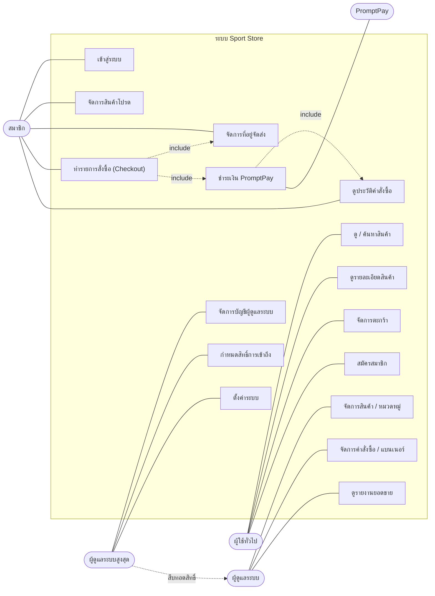
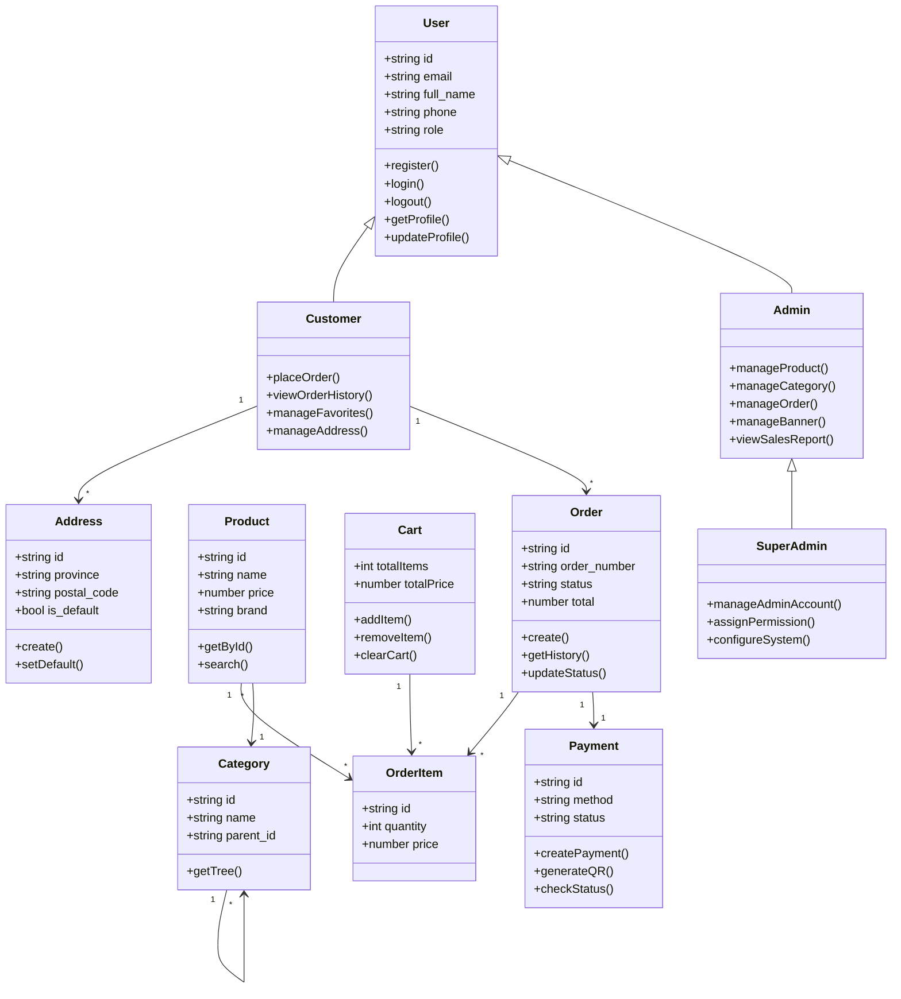
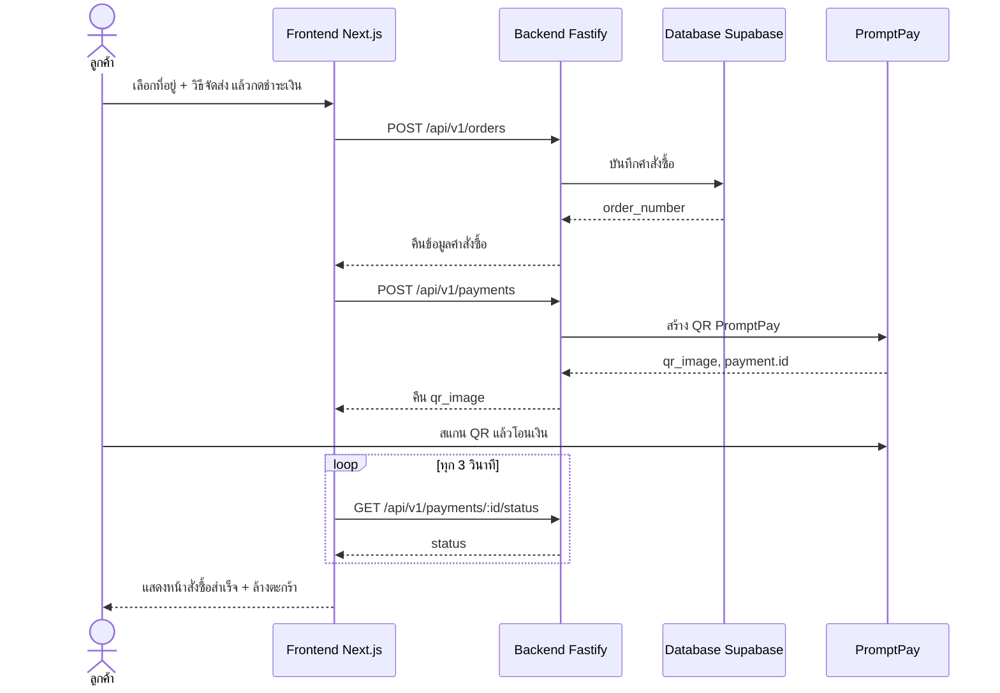
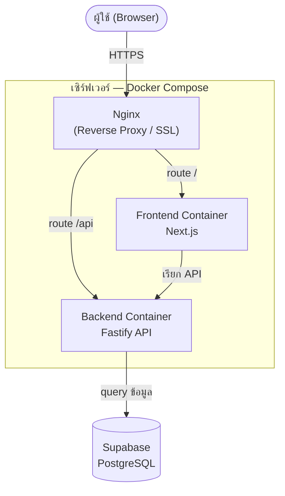

# Project 204 - Sport Store

Sport Store เป็นเว็บอีคอมเมิร์ซสำหรับขายสินค้าและอุปกรณ์กีฬา พัฒนาเป็นระบบแยก frontend และ backend โดยฝั่งหน้าเว็บใช้ Next.js สำหรับแสดงสินค้า หมวดหมู่ โปรโมชัน รายละเอียดสินค้า และตะกร้าสินค้า ส่วนฝั่ง API ใช้ Fastify เชื่อมต่อ Supabase เพื่อจัดการข้อมูลสินค้า หมวดหมู่ ผู้ใช้ ตะกร้า แบนเนอร์ โปรโมชัน และข้อมูลหน้าแรก

## รายละเอียดโปรเจกต์

โปรเจกต์นี้จำลองระบบร้านค้าออนไลน์สายกีฬา มีหน้าเว็บสำหรับให้ผู้ใช้เลือกดูสินค้า ค้นหาสินค้า ดูรายละเอียดสินค้า เลือกสินค้าเข้าตะกร้า และดูหมวดหมู่สินค้าต่าง ๆ พร้อม backend API สำหรับส่งข้อมูลไปยังหน้าเว็บ ระบบถูกแบ่งออกเป็น 2 ส่วนหลัก คือ

- `sport-store` ส่วน frontend ที่พัฒนาด้วย Next.js
- `sport-store-api` ส่วน backend API ที่พัฒนาด้วย Fastify และเชื่อมต่อ Supabase

## ฟีเจอร์หลัก

- หน้าแรกแสดง hero banner, หมวดหมู่สินค้า, ดีลสินค้า และสินค้าแนะนำ
- แสดงหมวดหมู่สินค้าแบบหลายระดับ
- หน้ารายละเอียดสินค้า พร้อมรูปภาพสินค้า ราคา ไซส์ สี รีวิว และสินค้าแนะนำ
- ระบบตะกร้าสินค้าแบบแผงด้านข้าง
- ระบบสมาชิก สมัครสมาชิก เข้าสู่ระบบ และจัดการเซสชันด้วย token
- หน้าบัญชีของฉัน รวมเมนูคำสั่งซื้อ สมุดที่อยู่ และสินค้าโปรด
- ประวัติคำสั่งซื้อและหน้ารายละเอียดคำสั่งซื้อ พร้อมสถานะการสั่งซื้อ
- สมุดที่อยู่จัดส่ง เพิ่ม แก้ไข ลบ พร้อมระบบกรอกที่อยู่ไทยและเติมจังหวัด/อำเภอจากรหัสไปรษณีย์อัตโนมัติ
- ระบบสินค้าโปรด บันทึกสินค้าที่ชอบไว้ดูภายหลัง
- ขั้นตอนชำระเงินแบบหลายสเต็ป เลือกที่อยู่ วิธีจัดส่ง และชำระเงินผ่าน QR พร้อมเพย์
- ส่วน feedback สำหรับผู้ใช้
- Backend API สำหรับสินค้า หมวดหมู่ ตะกร้า ผู้ใช้ แบนเนอร์ หน้าแรก โปรโมชัน recommendation และ bundle
- โครงสร้างฐานข้อมูลสำหรับสินค้า หมวดหมู่ รีวิว ตะกร้า คำสั่งซื้อ โปรโมชัน และ bundle

## เทคโนโลยีและเครื่องมือที่ใช้

### Frontend

- Next.js
- React
- TypeScript
- Tailwind CSS
- Lucide React
- ESLint

### Backend

- Fastify
- TypeScript
- Supabase
- Zod
- dotenv
- CORS, Helmet และ Rate Limit

### Database และเครื่องมืออื่น ๆ

- Supabase PostgreSQL
- SQL schema และ seed file
- Git และ GitHub
- npm หรือ Bun สำหรับจัดการแพ็กเกจ

## โครงสร้างโปรเจกต์

```text
Project-204/
  README.md
  sport-store/
    package.json
    src/
      app/
      components/
      lib/
  sport-store-api/
    package.json
    src/
      modules/
      plugins/
      config/
      shared/
    sql/
      001_init.sql
      002_seed.sql
```

## วิธีติดตั้งและรันโปรเจกต์

### 1. เตรียมฐานข้อมูล Supabase

สร้าง project ใน Supabase แล้วนำ SQL ในไฟล์ต่อไปนี้ไปรันใน Supabase SQL Editor ตามลำดับ

```text
sport-store-api/sql/001_init.sql
sport-store-api/sql/002_seed.sql
```

### 2. ตั้งค่า backend

เข้าไปที่โฟลเดอร์ API

```bash
cd sport-store-api
npm install
```

สร้างไฟล์ `.env` แล้วใส่ค่าตัวแปรดังนี้

```env
PORT=4000
HOST=0.0.0.0
NODE_ENV=development
SUPABASE_URL=your_supabase_url
SUPABASE_ANON_KEY=your_supabase_anon_key
CORS_ORIGIN=http://localhost:3000
```

รัน backend

```bash
npm run dev
```

API จะทำงานที่

```text
http://localhost:4000
```

ตรวจสอบสถานะ API ได้ที่

```text
http://localhost:4000/api/health
```

### 3. ตั้งค่า frontend

เปิด terminal อีกหน้าหนึ่ง แล้วเข้าไปที่โฟลเดอร์ frontend

```bash
cd sport-store
npm install
```

สร้างไฟล์ `.env.local` แล้วใส่ค่า API URL

```env
NEXT_PUBLIC_API_URL=http://localhost:4000
```

รัน frontend

```bash
npm run dev
```

เปิดเว็บที่

```text
http://localhost:3000
```

## API หลักที่มีในระบบ

- `/api/health` ตรวจสอบสถานะ server และ database
- `/api/v1/products` จัดการและเรียกดูข้อมูลสินค้า
- `/api/v1/categories` จัดการหมวดหมู่สินค้า
- `/api/v1/cart` จัดการตะกร้าสินค้า
- `/api/v1/auth` จัดการผู้ใช้และการเข้าสู่ระบบ
- `/api/v1/banners` จัดการแบนเนอร์
- `/api/v1/homepage` จัดการข้อมูลหน้าแรก
- `/api/v1/promotions` จัดการโปรโมชัน
- `/api/v1/recommendations` แนะนำสินค้า
- `/api/v1/bundles` จัดการชุดสินค้า

## หน้าหลักของ frontend

- `/` หน้าแรกของร้าน
- `/login` หน้าเข้าสู่ระบบ
- `/register` หน้าสมัครสมาชิก
- `/cart` หน้าตะกร้าสินค้า
- `/checkout` หน้าชำระเงิน เลือกที่อยู่ วิธีจัดส่ง และชำระผ่าน QR พร้อมเพย์
- `/category/[...slug]` หน้าหมวดหมู่สินค้า
- `/product/[id]` หน้ารายละเอียดสินค้า
- `/favorites` หน้าสินค้าโปรด
- `/account` หน้าบัญชีของฉัน
- `/account/orders` หน้าประวัติคำสั่งซื้อ
- `/account/orders/[id]` หน้ารายละเอียดคำสั่งซื้อ
- `/account/addresses` หน้าสมุดที่อยู่จัดส่ง

## แผนภาพระบบ (System Diagrams)

ไฟล์ต้นฉบับทั้งหมดอยู่ที่ [`docs/diagrams/`](docs/diagrams) (ไฟล์ `.mmd` + รูป `.png`)
ส่วน Wireframe / Prototype เปิดดูได้ที่ [`docs/wireframes.html`](docs/wireframes.html) และ [`docs/prototype.html`](docs/prototype.html)

### 1. Use Case Diagram

ผู้ใช้งานในระบบมี 4 บทบาท: **ลูกค้า (Guest/Member)**, **ผู้ดูแลระบบ (Admin)**, **ผู้ดูแลระบบสูงสุด (Super Admin)** และ **PromptPay** (ระบบชำระเงินภายนอก)



### 2. Class Diagram



### 3. Sequence Diagram — สั่งซื้อและชำระเงิน (PromptPay)



### 4. Deployment Diagram



## หมายเหตุการพัฒนา

ระบบนี้ออกแบบเป็น full-stack web application โดย frontend เรียกข้อมูลผ่าน backend API และ backend เชื่อมต่อฐานข้อมูล Supabase หากต้องการนำไปใช้งานจริงควรตั้งค่า environment variables ให้ครบ ตรวจสอบสิทธิ์การเข้าถึงฐานข้อมูล และทดสอบ API ก่อน deploy

## รายชื่อผู้จัดทำ

| รหัสนักศึกษา | ชื่อ-นามสกุล | กลุ่ม/ห้องปฏิบัติการ | ตำแหน่ง |
| --- | --- | --- | --- |
| 66083478 | ณัฐมน สุโพธิ์ | T002/L002 | นักพัฒนาส่วนหน้าและผู้ทดสอบคุณภาพระบบ (Frontend Developer & QA) |
| 67159957 | พลช ชูตระกูลวงศ์ | T003/L005 | นักพัฒนา Full-stack นักวิเคราะห์ระบบ และผู้ทดสอบคุณภาพระบบ (Full-stack Developer, System Analyst & QA) |
| 67130409 | เลปกร ศรีสมุทร | T003/L004 | นักพัฒนา Full-stack (Full-stack Developer) |
| 67126710 | ชิษณุพงศ์ สาตร์แก้ว | T003/L005 | ผู้จัดการโครงการ (Project Manager - PM) |


## Url
- https://demo-spu.neoragnaworld.com/
